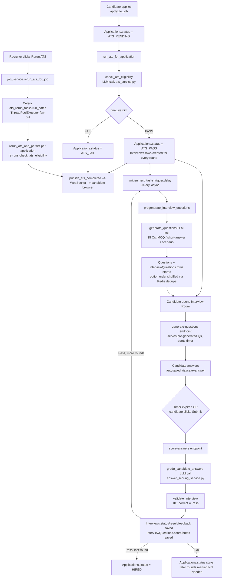

# ATS Screening & Written-Test Flow — Developer Reference

This document explains, in plain English, exactly how a candidate's application
gets screened by the ATS (Applicant Tracking System) and how the written test
that follows a PASS works — end to end, file by file, with real function
signatures and DB columns. It is written for the person who wrote this code
and just needs to re-load the details.

## Table of Contents

- [Part 1 — Big Picture](#part-1--big-picture)
  - [Summary](#summary)
  - [Pipeline Diagram](#pipeline-diagram)
  - [Files Involved](#files-involved)
  - [DB Tables Touched](#db-tables-touched)
  - [External Services](#external-services)
- [Part 2 — Feature-by-Feature Breakdown](#part-2--feature-by-feature-breakdown)
  - ATS Core
    1. [ATS screening trigger and end-to-end flow](#1-ats-screening-trigger-and-end-to-end-flow)
    2. [Strict Pydantic schema validation of LLM output](#2-strict-pydantic-schema-validation-of-llm-output)
    3. [Storing complete ATS result with UTC timestamp and model version](#3-storing-complete-ats-result-with-utc-timestamp-and-model-version)
    4. [Retry logic with exponential backoff](#4-retry-logic-with-exponential-backoff)
    5. [LangSmith logging of ATS prompts/responses](#5-langsmith-logging-of-ats-promptsresponses)
    6. [WebSocket event on ATS completion](#6-websocket-event-on-ats-completion)
    7. [Re-running ATS on an existing application](#7-re-running-ats-on-an-existing-application)
  - Written Test System
    8. [Async Celery trigger on ATS pass](#8-async-celery-trigger-on-ats-pass)
    9. [Personalised written assessment generation](#9-personalised-written-assessment-generation)
    10. [Question generation rules (min 15, MCQ/short-answer/scenario)](#10-question-generation-rules-min-15-mcqshort-answerscenario)
    11. [Storage model — questions/answers/evaluation as separate SQL rows](#11-storage-model--questionsanswersevaluation-as-separate-sql-rows)
    12. [Automatic answer evaluation using an LLM](#12-automatic-answer-evaluation-using-an-llm)
    13. [Pass threshold — 10+ correct answers](#13-pass-threshold--10-correct-answers)
    14. [Written-test result payload](#14-written-test-result-payload)
    15. [Configurable time limit with auto-submit](#15-configurable-time-limit-with-auto-submit)
    16. [MCQ option-order randomisation per candidate](#16-mcq-option-order-randomisation-per-candidate)
- [Part 3 — Reference Sections](#part-3--reference-sections)
  - [Data Flow Trace](#data-flow-trace)
  - [Failure Modes](#failure-modes)
  - [Known Gaps / TODOs](#known-gaps--todos)
  - [Glossary](#glossary)

---

# Part 1 — Big Picture

## Summary

When a candidate applies to a job, the application starts as `ATS_PENDING`.
The backend immediately calls an LLM (via LangChain's `ChatOpenAI`) that reads
the candidate's CV and the job posting, and produces a structured, weighted
score across six categories (experience, skills, projects, certifications,
education, achievements). Python — not the LLM — does the final arithmetic,
so the score is deterministic and auditable. If the candidate clears the
recruiter's configured threshold, the application flips to `ATS_PASS`,
`Interviews` rows are created for every round the recruiter configured, and a
background Celery task starts generating a 15-question written test (MCQ +
short-answer + scenario) personalised to the candidate's resume and the job's
requirements, so it's ready before the candidate even opens the round. The
candidate answers, autosave persists every keystroke, and on submit (or timer
expiry) another LLM call grades every answer, and a hardcoded rule (10+
correct out of the round) decides Pass/Fail. Recruiters can also manually
re-run ATS screening on already-scored applications (e.g. after editing a job
description) — this reprocesses candidates in the background via Celery and
pushes a live update to the candidate's browser via WebSocket.

## Pipeline Diagram

## Files Involved

| Path | Role |
|---|---|
| `backend/app/ai/ai_services/ats_service.py` | The ATS scoring engine — LLM prompt, strict schema, deterministic scoring math, retry logic, LangSmith tracing. |
| `backend/app/ai/ai_services/question_generation_service.py` | Calls the LLM to generate written-test questions. |
| `backend/app/ai/ai_services/answer_scoring_service.py` | Calls the LLM to grade candidate answers. |
| `backend/app/ai/ai_services/question_bank_service.py` | Resolves round/job/experience-level IDs into human-readable context for prompts; unused DB question-bank fallback (`fetch_questions_from_db`). |
| `backend/app/ai/ai_services/cv_relevance_service.py` | Fetches the candidate's parsed resume text for a given application. |
| `backend/app/ai/interview_tools/schemas.py` | Shared Pydantic I/O types for question generation / grading (not ATS — ATS has its own schemas). |
| `backend/app/ai/interview_tools/prompts.py` | System/user prompt text for question generation and answer grading. |
| `backend/app/api/endpoints/interviews.py` | REST endpoints: generate-questions, save-answer, score-answers, voice-interview, report-leave, conclude, status-stream (SSE). |
| `backend/app/api/endpoints/applications.py` | REST endpoints: apply, ats-check, run-ats, ack-ats-rerun, interview-stages, interview questions, my-applications. |
| `backend/app/api/endpoints/ws.py` | WebSocket endpoint `/ws/applications/{application_id}` — pushes `ats_completed` events. |
| `backend/app/api/endpoints/jobs.py` | Job posting endpoints, including recruiter-triggered ATS rerun (via `job_service`). |
| `backend/app/core/config.py` | `Settings` (env vars), `get_llm()` factory (`ChatOpenAI`). |
| `backend/app/schemas/interviews.py` | Pydantic request/response models for the interview/written-test REST API. |
| `backend/app/schemas/jobs.py` | Pydantic models for job posting, ATS criteria, rerun status. |
| `backend/app/schemas/applications.py` | Pydantic models for apply/ATS-check/interview-stages responses. |
| `backend/app/services/application_service.py` | Core orchestration: apply, run ATS, persist result, rerun decision matrix, interview-stage aggregation. |
| `backend/app/services/ats_lock.py` | Redis distributed lock so only one ATS run writes an application at a time; also rerun "generation" tracking. |
| `backend/app/services/interview_service.py` | Question generation/serving, answer saving/scoring orchestration, round-completion side effects. |
| `backend/app/services/interview_validator.py` | Single source of truth for Pass/Fail/score/feedback decisions (fail-case rules, written pass threshold). |
| `backend/app/services/job_service.py` | Job CRUD, recruiter-triggered ATS rerun selection/dispatch/status polling. |
| `backend/app/services/question_pregeneration_service.py` | Background (Celery-driven) written-test question generation. |
| `backend/app/services/question_order_service.py` | Redis-backed per-round dedupe: randomises question order and MCQ option order per candidate. |
| `backend/app/services/pregen_lock.py` | Redis lock preventing background pregeneration and live generation from racing on the same interview. |
| `backend/app/services/events.py` | In-process pub/sub so services can announce "ATS completed" without importing the WebSocket layer. |
| `backend/app/tasks/ats_rerun_tasks.py` | Celery task `ats_rerun_tasks.run_batch` — recruiter-triggered ATS rerun, fanned out via `ThreadPoolExecutor`. |
| `backend/app/tasks/written_test_tasks.py` | Celery task `written_test_tasks.trigger` — kicks off background question pregeneration. |
| `backend/app/celery_app.py` | Celery app config (`--pool=solo` on Windows). |
| `backend/app/services/mcq_redis_cache.py` | **Deleted in this branch** — predecessor of `question_order_service.py` (see [Known Gaps](#known-gaps--todos)). |
| `frontend/src/pages/InterviewRoom.tsx` | Candidate-facing written/oral interview UI — questions, MCQ rendering, autosave, countdown timer, auto-submit, results screen. |
| `frontend/src/pages/ApplicationProgress.tsx` | Candidate-facing ATS result display, WebSocket listener, rerun notice modal, per-round Q&A viewer. |
| `frontend/src/pages/RecruiterDashboard.tsx` | Recruiter "Rerun ATS" button + polling for rerun progress. |
| `frontend/src/api/applications.ts` | Frontend API client for apply/ATS/interview-stage endpoints. |
| `frontend/src/api/jobs.ts` | Frontend API client for job posting/rerun endpoints. |

## DB Tables Touched

| Table | Purpose | Key columns |
|---|---|---|
| `Applications` | One row per candidate-job application; carries ATS state and result. | `status` (`ATS_PENDING`→`ATS_PASS`/`ATS_FAIL`→`IN_PROGRESS`→`HIRED`/`REJECTED`, also `ATS_ERROR`), `ats_details` (full JSON result), `ats_evaluated_at`, `ats_model_version`, `ats_rerun_count`, `ats_rerun_unseen`, `pending_ats_rerun_*` (deferred rerun result), `ats_run_version` (staleness versioning), `resume_id` |
| `JobPostings` | The job posting, incl. ATS weighting config. | `ats_criteria` (JSON: criteria + thresholds), `ats_criteria_version` (bumped on edit, drives staleness) |
| `ATSEvaluationHistory` | Audit trail — snapshot of the *previous* ATS result taken right before a rerun overwrites it. | `application_id`, `status`, `ats_details`, `triggered_by` (`system`/`recruiter`), `recruiter_id`, `created_at` |
| `Resumes` | Parsed CV text used both by ATS and by written-test generation. | `candidate_id`, `parsed_text` |
| `InterviewRounds` | Recruiter-configured rounds for a job. | `round_order`, `interview_round_type_id`, `failing_criteria`, `time_limit_minutes` (written-test time limit) |
| `Interviews` | One row per candidate × round. | `status` (`Scheduled`/`In Progress`/`Pass`/`Failed`/`Not Needed`), `started_at` (timer anchor), `completed_at`, `feedback`, `result` (score as text) |
| `Questions` | The question bank (AI-generated per interview). | `question_text`, `question_type` (`mcq`/`short_answer`/`scenario`), `options` (JSON `{choices, correct_option}`, MCQ only) |
| `InterviewQuestions` | Links a `Questions` row to a specific `Interviews` row; holds the candidate's answer and grade. | `interview_id`, `question_id`, `candidate_answer`, `score`, `notes` |
| `DeletedInterviewRounds` | Tombstone for `Interviews` rows deleted by a PASS→FAIL ATS rerun. | `interview_id`, `application_id`, `deleted_reason` |
| `JobRequiredSkills` / `SkillSets` | Job's required skills — fed into both the ATS prompt and the question-generation prompt. | `skill_id`, `proficiency_level`, `is_mandatory` |

## External Services

- **OpenAI (via `langchain_openai.ChatOpenAI`)** — powers all three LLM calls: ATS scoring (`ats_service.py`), written-test question generation (`question_generation_service.py`), and answer grading (`answer_scoring_service.py`). Model is whatever `settings.OPENAI_MODEL` is set to (default in code: `"gpt-5.4-mini"` — see [Known Gaps](#known-gaps--todos)).
- **LangSmith** — traces every ATS prompt/response (`@traceable` on `_invoke_ats_llm`). Activated via env vars read directly from `os.environ` (`LANGCHAIN_TRACING_V2`, `LANGCHAIN_API_KEY`, `LANGCHAIN_PROJECT`, `LANGCHAIN_ENDPOINT`).
- **Redis** — four independent uses, all via the same client (`app.services.ats_lock.get_redis_client()`): (1) Celery broker/result backend, (2) `ats_lock.py` distributed lock so only one ATS run writes an application at a time, (3) `pregen_lock.py` distributed lock so live and background question generation don't race, (4) `question_order_service.py` per-round history list for MCQ/question-order dedupe.
- **Celery** — two background tasks: `written_test_tasks.trigger` (question pregeneration) and `ats_rerun_tasks.run_batch` (recruiter-triggered rerun). Runs single-process, `--pool=solo` (Windows-friendly; `OPENBLAS_NUM_THREADS=1` is set to avoid memory blowups under solo mode).
- **WebSockets** — `app/api/endpoints/ws.py`, one connection per `application_id`, server-push only. Delivers `ats_completed` events to the candidate's Application Progress page.
- **Server-Sent Events (SSE)** — `/api/interviews/{interview_id}/status-stream`, used only for **oral/voice** interviews to signal when backend post-processing (transcript extraction + scoring) has finished. Not used by the written-test flow.
- **LiveKit / Deepgram / ElevenLabs** — power the oral/voice interview round (out of scope for this doc — see `.claude/agent-architecture.md`).

---

# Part 2 — Feature-by-Feature Breakdown

## 1. ATS screening trigger and end-to-end flow

**What is it:**
The automatic process that scores a candidate's CV against a job posting the
moment they apply, and decides PASS or FAIL. It's the very first gate a
candidate goes through.

**How is it made:**
The apply endpoint creates the `Applications` row, then immediately (same
request) calls `run_ats_for_application`, which fetches candidate + job data
from SQL, builds a big structured prompt, calls the LLM, deterministically
re-computes every score in Python, and writes the result back to
`Applications`. The whole thing is wrapped in a Redis lock so a duplicate
apply-click or an in-flight rerun can't write over each other.

**Why is it made:**
Recruiters shouldn't have to manually screen every resume. Without this,
every application would sit un-triaged until a human looked at it.

**Implementation:**

*Database:*
`Applications` (`status`, `ats_details`, `ats_evaluated_at`, `ats_model_version`, `ats_run_version`), `JobPostings` (`ats_criteria`, `ats_criteria_version`), `Resumes.parsed_text`, `CandidateProfiles`, `CandidateSkills`, `JobRequiredSkills`.

*Backend:*
- `app/api/endpoints/applications.py:apply()` — creates the application (`apply_to_job`), then calls `run_ats_for_application(result.application_id)` in the same request; any exception here is logged but swallowed (the application still exists as `ATS_PENDING`).
- `app/services/application_service.py:run_ats_for_application(application_id)` (line 956) — fetches application/job/candidate data (`_fetch_application_for_ats`), returns cached result immediately if already scored, otherwise acquires `ats_lock` (`acquire_ats_lock`), snapshots `ats_criteria_version` (`_fetch_ats_criteria_version`), calls `check_ats_eligibility`, persists (`_persist_ats_result`), dispatches the written-test Celery trigger if passed, publishes the WebSocket event, and releases the lock in a `finally`.
- `app/ai/ai_services/ats_service.py:check_ats_eligibility(candidate_id, job_posting_id, parsed_text, application_id)` (line 898) — the actual pipeline: `_fetch_ats_data` (blocking DB read via `asyncio.to_thread`) → `_resolve_ats_weighting` → `_build_ats_prompt` → `_call_ats_llm` → `_score_ats_output`. Logs timing for candidate lookup, job lookup, and LLM call separately (`logger.info("ATS timing: ...")`) but does **not** enforce a hard deadline — "under 30s" is a target/observed figure from logs, not an enforced timeout.

*Frontend:*
`frontend/src/pages/ApplicationProgress.tsx` — on load, if `ats_status === 'pending'` and it hasn't already triggered, calls `runAts(applicationId)` (which hits `POST /api/applications/{id}/run-ats`) as a fallback in case the apply-time run didn't happen yet or is still `ATS_PENDING`. Shows an "ATS Screening in progress…" panel while pending.

*Config / Env vars:*
`OPENAI_API_KEY`, `OPENAI_MODEL` (`app/core/config.py`).

**How to test it manually:**
1. Apply to a job as a candidate (with or without a CV upload).
2. Watch the `Applications` row: `status` starts `ATS_PENDING`, then flips to `ATS_PASS` or `ATS_FAIL` within a few seconds.
3. Check backend logs for `ATS timing: total=...s` — confirms the full pipeline ran.
4. Open the Application Progress page — it should show the ATS breakdown once done.

---

## 2. Strict Pydantic schema validation of LLM-returned ATS JSON before any DB write

**What is it:**
Before anything from the LLM's response ever reaches the database, it's
forced through a strict Pydantic model. If the shape doesn't match exactly,
nothing is written.

**How is it made:**
`ats_service.py` defines `_ATSLLMOutput` (the raw LLM output shape) separately
from `ATSCheckResult` (the final, deterministically-scored shape returned to
callers). The LLM is called via `get_llm().with_structured_output(_ATSLLMOutput)`,
and the result is explicitly re-validated even though LangChain's structured
output already coerces it.

**Why is it made:**
LLMs occasionally return malformed or incomplete JSON, or `with_structured_output`
can hand back a bare `dict` instead of raising. Without an explicit
re-validation, a malformed response could silently corrupt `Applications.ats_details`,
or crash mid-persist leaving inconsistent state.

**Implementation:**

*Database:*
None written on failure — this is precisely the point. `Applications.status` is set to `ATS_ERROR` instead (queryable, distinct from `ATS_PENDING`).

*Backend:*
- `app/ai/ai_services/ats_service.py:_ATSLLMOutput` (line 155) — the raw schema the LLM must produce: `verdict`, `verdict_summary`, `requirement_matching[]`, `relevant_experience`, `section_matching[]`, `grace_credits[]`, `additional_cv_content[]`, each field itself a nested `BaseModel` with `Literal` type constraints (e.g. `match_type: Literal["exact","parent","alternative","exceeds","not_found","not_required"]`).
- `_call_ats_llm(system_prompt, user_message, candidate_id, job_posting_id, application_id)` (line 834) — invokes the LLM, catches `ValidationError` from `ainvoke` itself (raises `ATSValidationError` immediately — not retried, per its docstring: "a malformed response is not retryable"), then explicitly checks `isinstance(llm_result, _ATSLLMOutput)`; if not, calls `_ATSLLMOutput.model_validate(llm_result)` in a loop (up to 3 attempts, only for the "returned a dict instead of an instance" case), raising `ATSValidationError` on final failure.
- `ATSValidationError` (line 18) is its own exception class specifically so callers can distinguish "malformed output, never persist" from transient network errors.
- `application_service.run_ats_for_application` catches `ATSValidationError` specifically and calls `_mark_ats_error` (sets `Applications.status = 'ATS_ERROR'`), then re-raises.

*Frontend:*
Not applicable — this is a pure backend safety gate; the candidate never sees a malformed result because none is ever persisted.

*Config / Env vars:*
None beyond `OPENAI_MODEL`.

**How to test it manually:**
1. Hard to trigger deliberately without mocking the LLM. Easiest check: read the code path — search logs for `"ATS: LLM output failed schema validation"`.
2. Alternatively, temporarily break `_ATSLLMOutput` (e.g. add a required field the prompt doesn't produce) and re-run ATS on a test application — confirm `Applications.status` becomes `ATS_ERROR`, not a corrupted PASS/FAIL.

---

## 3. Storing complete ATS result in SQL with UTC timestamp and model version (audit trail)

**What is it:**
Every ATS result — the full breakdown, not just PASS/FAIL — is saved to SQL
along with exactly when it ran and which LLM model produced it.

**How is it made:**
`ATSCheckResult.model_dump_json()` is written wholesale into `Applications.ats_details`
(a JSON blob), alongside a UTC timestamp and the model identifier.

**Why is it made:**
Recruiters and candidates both need to see the *why* behind a decision (skill
match reasoning, section-by-section breakdown), not just PASS/FAIL. The model
version matters because prompts/models change over time — you need to know
which version scored a given candidate for fairness/audit purposes.

**Implementation:**

*Database:*
`Applications.ats_details` (`nvarchar(MAX)`, full `ATSCheckResponse` JSON), `Applications.ats_evaluated_at` (`datetime2`), `Applications.ats_model_version` (`varchar(100)`), `Applications.ats_run_version` (int, snapshot of `JobPostings.ats_criteria_version` at run start).

*Backend:*
- `app/services/application_service.py:_persist_ats_result(application_id, job_id, new_status, details_json, evaluated_at, model_version, criteria_version)` (line 923) — `UPDATE Applications SET status=?, ats_details=?, ats_evaluated_at=?, ats_model_version=?, ats_run_version=? WHERE id=?`.
- `run_ats_for_application` builds these values: `details_json = result.model_dump_json()`, `evaluated_at = datetime.now(timezone.utc)` (explicit UTC, not local time), `model_version` returned from `check_ats_eligibility` (which is just `settings.OPENAI_MODEL`, see `ats_service.py` line 947).
- The rerun path does the same via `_persist_ats_rerun_result` (line 299), and additionally writes an `ATSEvaluationHistory` row (`_insert_ats_history`, line 132) — a snapshot of the **previous** status/ats_details/evaluated_at/model_version — before overwriting, so there's a full audit trail across reruns, not just the latest state.

*Frontend:*
`ApplicationProgress.tsx:renderAtsResult()` renders the full stored breakdown (verdict, weightage per category, requirement matching table, relevant experience, section matching, grace credits) — all read straight from the persisted `ats_details` JSON via `GET /api/applications/{id}/interview-stages`.

*Config / Env vars:*
`OPENAI_MODEL`.

**How to test it manually:**
1. Run ATS on an application, then query `SELECT ats_details, ats_evaluated_at, ats_model_version FROM Applications WHERE id = ?`.
2. Confirm `ats_evaluated_at` is UTC (compare against `GETDATE()` which is server-local) and `ats_model_version` matches your `.env`'s `OPENAI_MODEL`.
3. Trigger a rerun and confirm a new row appears in `ATSEvaluationHistory` with the *previous* result.

---

## 4. Retry logic — failed ATS LLM calls retried up to 3 times with exponential backoff

**What is it:**
If the LLM call fails for a transient reason (timeout, rate limit, connection
drop, OpenAI 5xx), the system automatically retries a few times before giving
up — instead of instantly failing the candidate's screening.

**How is it made:**
A small retry loop wraps the actual LLM invocation, with a fixed backoff
schedule.

**Why is it made:**
Network blips and rate limits are common with LLM APIs. Without retry, a
transient hiccup would leave a candidate's application stuck or errored for
no real reason.

**Implementation:**

*Database:*
Not applicable — retries happen entirely before any DB write.

*Backend:*
- `app/ai/ai_services/ats_service.py:_invoke_ats_llm(structured_llm, messages)` (line 627, decorated `@traceable(name="ats_scoring_prompt", run_type="llm")`) — `delays = (2, 4)`; loops `for attempt in range(3)`; catches `_TRANSIENT_LLM_ERRORS` (line 619: `openai.APITimeoutError`, `openai.APIConnectionError`, `openai.RateLimitError`, `openai.InternalServerError`); on the 3rd failed attempt, re-raises instead of retrying again; sleeps `await asyncio.sleep(delays[attempt])` between attempts (2s after attempt 1, 4s after attempt 2 — true exponential-ish backoff, capped at 2 retries).
- This is explicitly scoped to *transient* errors only — a `ValidationError` (malformed output, see Feature 2) is a different failure class and is never retried here; it propagates immediately per the module docstring for `ATSValidationError`.
- The rerun path reuses the exact same `_TRANSIENT_LLM_ERRORS` tuple and catches it in `rerun_ats_and_persist` (line 445) to classify the outcome as `RerunOutcome.TRANSIENT_ERROR`, which the Celery layer (`ats_rerun_tasks._run_one_application`) retries again at a *higher* level (its own bounded retry, up to 3 attempts with a 10s countdown — see Feature 7).

*Frontend:*
Not applicable.

*Config / Env vars:*
None — the delay schedule (`2, 4`) and attempt count (`3`) are hardcoded constants, not env-configurable.

**How to test it manually:**
1. Hard to trigger organically. Easiest: temporarily point `OPENAI_API_KEY` at an invalid value or block network access to `api.openai.com`, then run ATS on a test application.
2. Watch logs for `"ATS: transient LLM error on attempt %d/3"` — confirms the retry loop fired with increasing delays.

---

## 5. LangSmith logging of every ATS prompt and response

**What is it:**
Every ATS LLM call is traced to LangSmith (a prompt/response observability
tool), tagged with which job, which application, and which model version
produced it.

**How is it made:**
The `@traceable` decorator from the `langsmith` package wraps the LLM
invocation function; LangChain/LangSmith read tracing config straight from
process environment variables.

**Why is it made:**
Lets a developer inspect exactly what prompt was sent and what came back for
any given candidate — essential for debugging bad scores or improving the
prompt over time.

**Implementation:**

*Database:*
Not applicable — LangSmith is an external SaaS, not part of the app's SQL schema.

*Backend:*
- `app/ai/ai_services/ats_service.py:_invoke_ats_llm` (line 627-628) — `@traceable(name="ats_scoring_prompt", run_type="llm")`.
- `_call_ats_llm` (line 856) passes `langsmith_extra={"metadata": {"job_posting_id": ..., "application_id": ..., "model_version": settings.OPENAI_MODEL}}` into the traced call, so every trace in the LangSmith dashboard is filterable by job/application/model.
- `app/core/config.py` (lines 9-13, 46-50) — `LANGCHAIN_TRACING_V2`, `LANGCHAIN_API_KEY`, `LANGCHAIN_PROJECT` (default `"russell-recruiter-ats"`), `LANGCHAIN_ENDPOINT` are declared on `Settings` but a comment explicitly notes they are **not** read via `settings.X` by the tracing machinery — `load_dotenv(_ENV_FILE)` exports the `.env` file straight into `os.environ`, which is what `langsmith`/`langchain` internals actually read.
- **Scope note:** only the ATS LLM call (`_invoke_ats_llm`) is decorated `@traceable`. `question_generation_service.generate_questions()` and `answer_scoring_service.grade_candidate_answers()` have no `@traceable` decorator — they are not traced to LangSmith (see [Known Gaps](#known-gaps--todos)).

*Frontend:*
Not applicable.

*Config / Env vars:*
`LANGCHAIN_TRACING_V2` (must be `true` to activate), `LANGCHAIN_API_KEY`, `LANGCHAIN_PROJECT`, `LANGCHAIN_ENDPOINT`.

**How to test it manually:**
1. Set `LANGCHAIN_TRACING_V2=true` and a valid `LANGCHAIN_API_KEY` in `.env`.
2. Run ATS on a test application.
3. Open the LangSmith dashboard for the `russell-recruiter-ats` project (or your configured `LANGCHAIN_PROJECT`) and confirm a new trace named `ats_scoring_prompt` appears with the right metadata.

---

## 6. WebSocket event emitted to candidate's browser when ATS screening completes

**What is it:**
The candidate's Application Progress page updates live the moment ATS
finishes — no manual refresh or polling needed.

**How is it made:**
A lightweight in-process publish/subscribe bus decouples the service layer
from the transport layer; the WebSocket endpoint subscribes to it and forwards
events to whichever browser connection is open for that `application_id`.

**Why is it made:**
Without this, the candidate would have to refresh the page repeatedly to find
out if they passed ATS. It also keeps the service layer (`application_service.py`)
from having to import the API/WebSocket layer directly (would be a layering
violation — services shouldn't depend on transport).

**Implementation:**

*Database:*
Not applicable — this is a live, ephemeral notification, not persisted (the underlying `Applications` row is already committed by this point).

*Backend:*
- `app/services/events.py` — `subscribe_ats_completed(handler)` registers a handler; `publish_ats_completed(application_id, payload)` (async) calls every registered handler, swallowing and logging any handler exception so one broken subscriber can't break the publisher.
- `app/services/application_service.py` calls `await publish_ats_completed(application_id, {...})` in two places: `run_ats_for_application` (line 1018, first-time scoring) and `rerun_ats_and_persist` (line 477, only `if not deferred` — a deferred PASS→FAIL rerun, held back because a round is `In Progress`, does **not** notify yet).
- Payload shape: `{"event": "ats_completed", "application_id", "status", "verdict", "final_verdict", "verdict_summary", "weightage", "is_rerun"?: true}`.
- `app/api/endpoints/ws.py` — `ConnectionManager` (in-memory, keyed by `application_id`, single-process only — no cross-process fanout); `subscribe_ats_completed(_forward_ats_completed)` is called at module import time to register the forwarder; `@router.websocket("/ws/applications/{application_id}")` accepts connections and just holds them open (server-push only, `while True: await websocket.receive_text()`).

*Frontend:*
`frontend/src/pages/ApplicationProgress.tsx` (lines 313-356) — opens `new WebSocket(\`${WS_BASE}/ws/applications/${applicationId}\`)`; on `ws.onmessage`, parses the payload and if `payload.event === 'ats_completed'`, calls `fetchStages()` to re-fetch the full interview-stages REST response (does **not** trust the WS payload directly as the source of truth — treats it purely as a "something changed, go refetch" signal). Reconnects with exponential backoff (`Math.min(1000 * 2 ** attempt, 15000)`) on `ws.onclose`.

*Config / Env vars:*
None specific — uses the same `VITE_API_URL` as REST, with `http`→`ws` substitution.

**How to test it manually:**
1. Open the Application Progress page for a pending application in a browser (so the WS connects).
2. Trigger ATS scoring (apply, or call `run-ats`) from another tab/client.
3. Confirm the open page updates automatically without a refresh, and check the Network tab's WS frames for the `ats_completed` message.

---

## 7. Re-running ATS screening on an existing application when recruiter explicitly requests it

**What is it:**
A recruiter can force a full re-screen of every eligible candidate on a job —
e.g. after editing the job description or required skills — without asking
candidates to re-apply.

**How is it made:**
A job-scoped selection query picks eligible applications, dispatches **one**
Celery task for the whole batch, which internally fans work out across
threads (not more Celery tasks), each running the exact same
`check_ats_eligibility` LLM pipeline as a first-time run, then applying a
PASS/FAIL transition decision matrix.

**Why is it made:**
Job requirements change. Without this, a candidate scored against an old,
looser job description would stay incorrectly PASSed (or FAILed) forever,
even after the recruiter tightens or loosens the bar.

**Implementation:**

*Database:*
`Applications` (`ats_run_version` vs `JobPostings.ats_criteria_version` — staleness check), `ATSEvaluationHistory` (previous-result snapshot), `Interviews` + `DeletedInterviewRounds` (rounds are deleted/tombstoned on a PASS→FAIL transition), `Applications.pending_ats_rerun_*` (deferred-fail holding area).

*Backend:*
- `app/services/job_service.py:select_applications_for_ats_rerun(job_id)` (line 613) — excludes `HIRED`/`REJECTED` applications, applications with a `Failed` round, applications with a round `In Progress`, applications that cleared every round, and applications already scored against the current `ats_criteria_version` (i.e. not stale). `ATS_PENDING` applications are always included (never scored, so staleness doesn't apply).
- `job_service.rerun_ats_for_job(job_id, recruiter_id)` (line 659) — selects applications, stamps them with a fresh rerun "generation" token (`set_latest_rerun_generation_batch`, so a re-click supersedes a still-running older batch), dispatches `ats_rerun_tasks.run_batch.delay(selected, recruiter_id, rerun_id)`, and returns immediately (does not wait for the batch).
- `app/tasks/ats_rerun_tasks.py:run_batch(application_ids, recruiter_id, rerun_id)` (line 97, `@celery_app.task`) — a single Celery task per rerun *request*, not per application; internally creates a `ThreadPoolExecutor(max_workers=count)` and submits `_run_one_application` per application. This is the parallel-execution piece explicitly called out as "remaining work" in the commit history — it's implemented (thread-per-application), not sequential.
- `_run_one_application(application_id, recruiter_id, rerun_id)` (line 34) — up to `_MAX_ATTEMPTS_PER_APPLICATION = 3` attempts, `_RETRY_COUNTDOWN_SECONDS = 10` sleep between attempts, checks `is_latest_rerun_generation` before every attempt so a superseded rerun abandons cleanly (`RerunOutcome.SUPERSEDED`).
- `app/services/application_service.py:rerun_ats_and_persist(application_id, recruiter_id)` (line 393) — acquires `ats_lock`, re-fetches fresh data, calls `check_ats_eligibility` again (always live, never cached), then `_persist_ats_rerun_result` (line 299) applies one of four transitions:
  - **PASS→FAIL**: if a round is `In Progress`, the fail is *deferred* (written to `pending_ats_rerun_*` columns, applied later once that round concludes — see `apply_pending_ats_rerun`, line 204); otherwise applied immediately, deleting all non-in-progress `Interviews` rows (tombstoned into `DeletedInterviewRounds` first).
  - **FAIL/PENDING/ERROR→PASS**: treated like a first-time pass — creates `Interviews` rows, triggers written-test pregeneration for the next round.
  - **PASS→PASS or FAIL→FAIL**: overwrites `ats_details` only, no status/interview change.
- Recruiter-facing endpoints: `POST /api/jobs/{job_id}/rerun-ats` (dispatch), polled status via `GET .../ats-rerun-status` → `job_service.get_ats_rerun_status(job_id)` (reads a Redis-cached batch snapshot, compares each application's `ats_evaluated_at` against the dispatch time to compute progress).

*Frontend:*
`frontend/src/pages/RecruiterDashboard.tsx` — "Rerun ATS" button (`handleRerunAts`, line 207) calls `rerunAts(jobId, recruiterId)`, then polls `fetchAtsRerunStatus(jobId)` every 3s (`pollRerunStatus`, line 178) until `in_progress` is false, showing `Rerunning ATS… (completed/total)`. Also surfaces `in_progress_count` (candidates skipped entirely because they're mid-interview). `frontend/src/pages/ApplicationProgress.tsx` shows a one-time "ATS Screening Updated" modal (`ATSRerunNotice`) driven by `Applications.ats_rerun_unseen`, acknowledged via `ackAtsRerunNotice`.

*Config / Env vars:*
`CELERY_BROKER_URL` (Redis). Celery must run as `celery -A app.celery_app worker --pool=solo` per the code comments (Windows-targeted).

**How to test it manually:**
1. As a recruiter, edit a job's ATS criteria/description (bumps `ats_criteria_version`).
2. Open the job's detail dialog and click "Rerun ATS".
3. Watch the button change to `Rerunning ATS… (n/total)`.
4. As the affected candidate, confirm the Application Progress page shows a "previously X, now Y" modal once the rerun completes.

---

## 8. Async Celery trigger that starts written-test generation when candidate passes ATS

**What is it:**
The moment ATS passes, question generation for the next round starts in the
background — so by the time the candidate clicks into the interview room, the
questions are usually already sitting in the database.

**How is it made:**
A fire-and-forget Celery task is enqueued right after the ATS-pass DB write
commits; it calls the same generation logic the live endpoint would, just
ahead of time.

**Why is it made:**
LLM question generation takes a few seconds. Without pregeneration, every
candidate would stare at a loading spinner on the interview room's first
load. This eliminates that wait for the common case.

**Implementation:**

*Database:*
Reads `Interviews`/`InterviewRounds`/`Questions` to check nothing already exists; writes `Questions` + `InterviewQuestions` (see Feature 11).

*Backend:*
- Trigger points (all `.delay(interview_id)`, meaning "enqueue and return immediately"):
  - `application_service.run_ats_for_application` (line 1015-1016) — first round, right after `_persist_ats_result` returns a `target_interview_id`.
  - `application_service._persist_ats_rerun_result` → `rerun_ats_and_persist` (line 465-474) — same, for a FAIL→PASS rerun outcome.
  - `interview_service.score_interview_answers` (line 1057-1064) — next round, after a prior round is scored `Pass`.
- `app/tasks/written_test_tasks.py:trigger(interview_id)` (line 10, `@celery_app.task(name="written_test_tasks.trigger")`) — wraps `asyncio.run(_run(interview_id))` in a try/except that logs and swallows **any** exception; explicitly documented as "fully best-effort, single attempt, no retry" — the live `generate_interview_questions()` endpoint is the fallback if this fails or hasn't finished yet.
- `app/services/question_pregeneration_service.py:pregenerate_interview_questions(interview_id)` (line 31) — skips (returns `False`, no DB write) for oral/voice rounds (driven live by the voice agent instead) or if questions already exist; acquires `pregen_lock` (Redis) so it can't race a candidate who's already triggered live generation for the same `interview_id`; on success, calls `_generate_with_retry` (up to `MAX_GENERATION_ATTEMPTS = 3`, only for genuine exceptions — this is the one call site in this whole flow that *does* retry the LLM generation call itself, unlike the live path).

*Frontend:*
Not applicable directly — the frontend never calls this task; it only benefits from its side effect (fast question load on `POST /generate-questions`).

*Config / Env vars:*
`CELERY_BROKER_URL`.

**How to test it manually:**
1. Apply as a candidate and pass ATS.
2. Immediately query `SELECT COUNT(*) FROM InterviewQuestions WHERE interview_id = ?` for the next round's `Interviews.id` — should populate within a few seconds, before the candidate even opens the interview room.
3. Stop the Celery worker, repeat, and confirm the candidate can still start the interview (fallback path generates live, just slower).

---

## 9. Personalised written assessment generation using resume + job description + department + required skills

**What is it:**
The written test isn't generic — it's generated per candidate, drawing on
their actual resume and the specific job's description and required skills.

**How is it made:**
Two data-fetch calls assemble context (job side + candidate side), then a
single structured LLM call produces the question set from that context.

**Why is it made:**
Generic question banks don't test what actually matters for *this* candidate
and *this* role. Personalisation makes the test a meaningful signal instead
of a canned quiz.

**Implementation:**

*Database:*
`JobPostings.description`, `JobRoles.title`/`category`, `ExperienceLevels.name`, `InterviewRoundTypes.name`, `JobRequiredSkills`/`SkillSets`, `Applications.resume_id` → `Resumes.parsed_text`.

*Backend:*
- `app/ai/ai_services/question_bank_service.py:fetch_interview_context(interview_round_type_id, job_role_id, experience_level_id, job_posting_id)` (line 49) — returns an `InterviewContext` dataclass: `job_role_title`, `job_role_category` (this is what stands in for "department" — see [Known Gaps](#known-gaps--todos), there is no literal `department` field), `experience_level_name`, `round_type_name`, `job_description`, `required_skills[]`.
- `app/ai/ai_services/cv_relevance_service.py:fetch_candidate_cv_relevance(application_id)` (line 4) — looks up `Applications.resume_id` → `Resumes.parsed_text`; returns `""` if no resume attached.
- `app/services/interview_service.py:generate_interview_questions` (live path, line 866-871) and `app/services/question_pregeneration_service.py:pregenerate_interview_questions` (background path, line 79-95) both assemble the same inputs: `context = await fetch_interview_context(...)`, `parsed_cv_text = await fetch_candidate_cv_relevance(...)`, wrapped into a `CandidateCVRelevance(job_experience_summary=parsed_cv_text, relevant_skills=[], relevant_projects=[])` — note `relevant_skills`/`relevant_projects` are always passed empty in both call sites; only the raw resume text (`job_experience_summary`) is actually populated (the `RelevantSkill`/`RelevantProject` structured extraction described by the schema is defined but not wired up here).
- `app/ai/ai_services/question_generation_service.py:generate_questions(example_questions, candidate_relevance, count, context, recent_mcq_orderings=None)` (line 54) — formats everything into `GENERATE_QUESTIONS_USER_PROMPT` (job role/category, experience level, round type, job description, required skills, candidate background) and calls `get_llm(temperature=0.7).with_structured_output(GeneratedQuestions)`.

*Frontend:*
Not applicable — generation is entirely server/background-side; the candidate only ever sees the finished question set.

*Config / Env vars:*
`OPENAI_API_KEY`, `OPENAI_MODEL`.

**How to test it manually:**
1. Apply with two different resumes (different skill sets) to the same job, pass ATS on both.
2. Compare the generated question sets — they should differ in content even though the job/role/experience-level context is identical, because the resume text differs.

---

## 10. Question generation rules — minimum 15 questions covering MCQ, short-answer, and scenario-based formats

**What is it:**
Every written test has exactly 15 questions, with a mix of multiple-choice,
open-ended short-answer, and scenario-based questions — the mix ratio depends
on the job's category and the candidate's experience level.

**How is it made:**
A constant fixes the count; a detailed prompt (with lookup tables) instructs
the LLM on the format mix per role category/experience level.

**Why is it made:**
15 questions is a large enough sample to measure both breadth and depth
without making the test unreasonably long; mixing formats tests different
things (MCQ = recall/precision, short-answer = explanation, scenario =
applied judgment).

**Implementation:**

*Database:*
`Questions.question_type` (`mcq`/`short_answer`/`scenario`), `Questions.options` (MCQ only).

*Backend:*
- `app/services/interview_service.py:WRITTEN_TEST_QUESTION_COUNT = 15` (line 45) — passed as `count=WRITTEN_TEST_QUESTION_COUNT` to `generate_questions(...)` from both the live path (line 869) and the background pregeneration path (`question_pregeneration_service.py` line 148).
- `app/ai/interview_tools/prompts.py:GENERATE_QUESTIONS_SYSTEM_PROMPT` (lines 12-92) — three lookup tables by job-role category (Tech / Product & Management / Business & Operations) × experience level (Junior/Mid/Senior), each giving an MCQ%/Question-Answer%/Scenario% split (e.g. Tech Junior = 30/50/20, Tech Senior = 10/30/60). Two overrides take precedence: HR/culture-fit rounds get 100% open-ended, no MCQs; Director/Executive/Leadership rounds ignore the candidate's actual experience level and force a senior-style, system-design-heavy question set.
- `app/ai/interview_tools/schemas.py:QuestionItem` — `question_type: str = "short_answer"` with allowed values `"mcq" | "short_answer" | "scenario"`; MCQ items require `options` (3-5 choices) and `correct_option` (must match one option verbatim).
- The LLM is trusted to hit the count/mix — there's no post-hoc Python validation that exactly 15 questions or a particular format ratio came back; `generate_interview_questions`/`pregenerate_interview_questions` use whatever `generated.generated_questions` contains as-is.

*Frontend:*
`InterviewRoom.tsx` renders each question by `q.question_type`: MCQ questions render as a radio-button group (`role="radiogroup"`); everything else renders as a free-text `<textarea>`.

*Config / Env vars:*
None (the count and mix tables are hardcoded).

**How to test it manually:**
1. Generate a written test for a Junior Tech-role candidate and count the questions/types returned by `POST /api/interviews/{id}/generate-questions` — expect 15 total, roughly a 30/50/20 MCQ/QA/scenario split (LLM adherence isn't guaranteed exactly, since there's no server-side count/ratio enforcement).
2. Repeat for a Senior role and confirm the MCQ share drops and scenario share rises per the table.

---

## 11. Storage model — questions, answers, evaluation as separate SQL rows linked by application ID

**What is it:**
The actual question text, the candidate's answer, and the AI's evaluation
each live in their own table/columns, so they can be queried and updated
independently.

**How is it made:**
Three tables: `Questions` (the question bank entry), `InterviewQuestions`
(the per-candidate link row holding the answer + score), `Interviews` (the
round-level status/result). `Interviews.application_id` is the actual FK to
`Applications` — questions/answers are linked to an *interview*, and the
interview is linked to the application, one hop away.

**Why is it made:**
Separating the question definition from the candidate's answer lets the same
`Questions` row (in principle) be reused, keeps the grading data
(`score`/`notes`) independently updatable without touching the question text,
and keeps `Interviews` as the single place round-level state lives.

**Implementation:**

*Database:*
- `Questions`: `id`, `interview_round_type_id`, `job_role_id`, `experience_level_id`, `question_text`, `question_type`, `options` (JSON), `is_active`, `ai_generated`, `created_at`.
- `InterviewQuestions`: `id`, `interview_id` (FK → `Interviews`), `question_id` (FK → `Questions`), `candidate_answer`, `score`, `notes`.
- `Interviews`: `id`, `interview_round_id`, `application_id` (FK → `Applications`), `status`, `started_at`, `completed_at`, `feedback`, `result`.
- **Note on the ticket's exact wording** ("linked by application ID"): there is no `application_id` column on `Questions` or `InterviewQuestions` directly — the link is `InterviewQuestions.interview_id → Interviews.id → Interviews.application_id`. Every query in this codebase that needs "this application's answers" joins through `Interviews` (see `application_service.get_interview_questions`, `job_service.get_candidate_panel`).

*Backend:*
- `app/services/interview_service.py:store_generated_questions(cur, interview_id, questions, interview_round_type_id, job_role_id, experience_level_id, job_posting_id)` (line 293) — inserts one `Questions` row + one `InterviewQuestions` row per generated question, in the same transaction.
- `_save_candidate_answers(cur, interview_id, answers)` (line 340) — `UPDATE InterviewQuestions SET candidate_answer = ? WHERE id = ? AND interview_id = ?`, independent of scoring.
- `_save_scores_and_complete(cur, interview_id, iq_ids, graded_answers, overall_score, interview_result, ai_feedback)` (line 477) — writes `InterviewQuestions.score`/`notes` per question, then `Interviews.status`/`result`/`feedback`/`completed_at` — two distinct writes, question-level and round-level.
- `_update_generated_questions` (line 241) handles a regenerate producing a different question count than a prior attempt — pairs old/new by position, deletes surplus `InterviewQuestions`+`Questions` rows for a shrink, inserts extra rows for a grow.

*Frontend:*
`ApplicationProgress.tsx:fetchRoundQuestions` calls `GET /api/applications/{applicationId}/interviews/{interviewId}/questions` to display a completed round's Q&A, independent of the round's pass/fail summary.

*Config / Env vars:*
None.

**How to test it manually:**
1. After a candidate completes a written round, run: `SELECT q.question_text, iq.candidate_answer, iq.score, iq.notes FROM InterviewQuestions iq JOIN Questions q ON q.id = iq.question_id WHERE iq.interview_id = ?`.
2. Confirm question text, answer, and score/notes are all independently present and correct.
3. Confirm `Interviews.result`/`status` for that same `interview_id` reflects the aggregate outcome.

---

## 12. Automatic evaluation of submitted answers using an LLM

**What is it:**
Once a candidate submits (or the timer expires), every answer is graded
automatically by an LLM — no human marker involved.

**How is it made:**
A single structured LLM call receives every question+answer pair (plus MCQ
correct answers) and returns a score (0-10) and short notes per answer, plus
an overall score and improvement recommendations.

**Why is it made:**
Manual grading doesn't scale and isn't consistent between reviewers. An LLM
grader is fast and applies the same rubric to every candidate.

**Implementation:**

*Database:*
`InterviewQuestions.score`, `InterviewQuestions.notes` (written after grading).

*Backend:*
- `app/ai/ai_services/answer_scoring_service.py:grade_candidate_answers(answers, interview_type="written")` (line 6) — calls `get_llm().with_structured_output(GradedAnswers)`; builds a `Q:`/`Type:`/`Correct option:`/`A:` block per answer; appends an oral-vs-non-oral rule-set note to the system prompt (`GRADE_ANSWERS_SYSTEM_PROMPT` + `round_note`).
- **Model used**: `get_llm()` from `app/core/config.py:get_llm(temperature=0, **kwargs)` — `ChatOpenAI(model=settings.OPENAI_MODEL, ...)`. `settings.OPENAI_MODEL` defaults to `"gpt-5.4-mini"` in code (`config.py` line 23) — **the ticket's "GPT-4o" is not hardcoded anywhere**; whichever model string is set in `.env`/`Settings` is what actually grades answers. See [Known Gaps](#known-gaps--todos).
- `app/ai/interview_tools/prompts.py:GRADE_ANSWERS_SYSTEM_PROMPT` (lines 131-263) — a detailed reasoning-first rubric: classify each answer (STRONG/ADEQUATE/VAGUE/INVALID/NONSENSE) *before* assigning a score band (9-10/7-8/4-6/1-3/0), explicit anti-bluffing rules ("confidently incorrect reasoning must score LOWER than an incomplete but logically correct answer"), MCQ answers are graded deterministically (10 if `candidate_answer` case/whitespace-insensitively matches `correct_option`, else 0 — bypassing the reasoning rubric entirely), oral answers ignore grammar/STT noise, written answers weigh grammar lightly.
- `app/services/interview_service.py:score_interview_answers` (line 929) — reconciliation step (lines 1001-1025): because the LLM's structured output isn't 100% trustworthy for *what the candidate actually wrote* or *how many it graded*, results are re-aligned positionally against the DB-backed question list (`to_score`), padding any missing graded answers with a forced `score=0` and overwriting `candidate_answer` with the real submitted text (never trusting an LLM-paraphrased echo) — a blank submitted answer is always forced to `score=0` regardless of what the LLM returned.

*Frontend:*
`InterviewRoom.tsx` phase `'submitting'` shows "Scoring your answers…" while `POST /score-answers` is in flight; results phase renders each `graded_answers[i]` with score, `is_correct` badge, and notes.

*Config / Env vars:*
`OPENAI_API_KEY`, `OPENAI_MODEL`.

**How to test it manually:**
1. Submit a written test with a mix of clearly correct, clearly wrong, and blank answers.
2. Confirm scores land in the expected bands (blank → 0, correct MCQ → 10, wrong MCQ → 0).
3. Confirm `notes` reference something concrete from the actual answer text, not generic filler.

---

## 13. Pass candidates with 10 or more correct answers and fail those below

**What is it:**
For written rounds, passing isn't based on an average score — it's a hard
count: at least 10 of the questions must individually be "correct" (scored
≥ 7/10).

**How is it made:**
Two constants work together: a per-question correctness threshold, and a
minimum-correct-count threshold, both applied in the shared validator that
every round-completion path calls through.

**Why is it made:**
A single uniform, deterministic rule (as opposed to a fuzzy average-score
cutoff) makes the pass bar identical and auditable across every application —
exactly the stated goal ("threshold is uniform across all applications").

**Implementation:**

*Database:*
`Interviews.result` (final score), `Interviews.status` (`Pass`/`Failed`).

*Backend:*
- `app/services/interview_service.py:CORRECT_ANSWER_SCORE_THRESHOLD = 7` (line 46) — a question counts as "correct" once its LLM-assigned score is ≥ 7/10. `correct_count = sum(1 for g in graded.graded_answers[:len(to_score)] if g.score >= CORRECT_ANSWER_SCORE_THRESHOLD)` (line 1023-1025).
- `app/services/interview_validator.py:WRITTEN_TEST_MIN_CORRECT = 10` (line 22) — `_determine_pass_status(inp, score, logs)` (line 66): for written (non-oral) calls where `correct_count` was supplied, `status = "Pass" if inp.correct_count >= WRITTEN_TEST_MIN_CORRECT else "Failed"`; oral rounds (or a written call missing `correct_count`) fall back to the continuous `score >= failing_criteria` comparison instead.
- This rule flows through `validate_interview(ValidationInput(..., correct_count=correct_count, interview_type=interview_type))` inside `score_interview_answers` (line 1028-1036) — the single choke point every completion path (submit, timer expiry, tab-switch fail-case) goes through, so the 10-correct rule is applied uniformly regardless of *how* the round ended.

*Frontend:*
`InterviewRoom.tsx` results screen (lines 1059-1084) — shows "Passed Questions: {passed_questions} out of {total_questions}", "Passing Criteria: at least {passing_threshold} questions must be passed", and a PASS/FAIL badge from `results.result`.

*Config / Env vars:*
None — both `10` and `7` are hardcoded Python constants, not env-configurable.

**How to test it manually:**
1. Submit a written test where exactly 9 answers would plausibly score ≥7 — confirm `result: "Failed"`.
2. Submit one where 10+ would plausibly score ≥7 — confirm `result: "Pass"`.
3. Check `passing_threshold` in the API response is `10` and `passed_questions` matches your count of ≥7-scored answers.

---

## 14. Written-test result payload — overall score, question-wise correctness, answer-level feedback, and improvement recommendations

**What is it:**
The result the candidate (and recruiter) sees isn't just a number — it
includes per-question correctness, per-answer notes, and a short paragraph of
actionable improvement advice.

**How is it made:**
A single Pydantic response model bundles everything the grading LLM call and
the pass/fail validator produced.

**Why is it made:**
A bare score is not actionable for either the candidate (what to improve) or
the recruiter (why this candidate passed/failed). Confirmed already
implemented — this doc verifies the shape matches the requirement.

**Implementation:**

*Database:*
Read back from `InterviewQuestions.score`/`notes` and `Interviews.result`/`feedback` on later views (`get_interview_questions`, `get_candidate_panel`); not stored as a single payload — assembled fresh on each score/read.

*Backend:*
- `app/schemas/interviews.py:ScoreAnswersResponse` (line 58) — `overall_score`, `total_graded`, `graded_answers: list[GradedAnswer]`, `result` ("Pass"/"Failed"), `improvement_recommendations`, `total_questions`, `passed_questions`, `passing_threshold`.
- `GradedAnswer` (line 50) — `question_text`, `candidate_answer`, `score`, `notes`, `is_correct` (derived: `score >= CORRECT_ANSWER_SCORE_THRESHOLD`).
- `app/ai/interview_tools/schemas.py:GradedAnswers` — the raw LLM output shape (`overall_score`, `total_graded`, `graded_answers[]`, `improvement_recommendations`), produced by `grade_candidate_answers`.
- `GRADE_ANSWERS_SYSTEM_PROMPT`'s "Improvement Recommendations" section (lines 251-262) — explicitly instructs the LLM to draw *only* from STRONG/ADEQUATE/VAGUE answers (genuine attempts with room to improve), never from INVALID/NONSENSE ones, and to return an empty string if there's nothing constructive to say either way.
- `app/services/interview_service.py:score_interview_answers` assembles the final `ScoreAnswersResponse` (lines 1106-1128), using `len(to_score)` (not the LLM's self-reported `total_graded`) as the authoritative question count, per the reconciliation logic in Feature 12.

*Frontend:*
`InterviewRoom.tsx` results screen renders: an overall summary card (score/10 for oral, or passed/total for written), an "Improvement Recommendations" card (only if non-empty), and a per-question graded list with score badge, PASS/FAIL correctness badge, the candidate's own answer, and feedback notes.

*Config / Env vars:*
None beyond the LLM config already listed.

**How to test it manually:**
1. Submit a written test and inspect the `POST /score-answers` JSON response — confirm all fields (`overall_score`, `graded_answers[]` with `notes`, `improvement_recommendations`, `passed_questions`/`total_questions`/`passing_threshold`) are populated.
2. Confirm an all-STRONG submission yields empty `improvement_recommendations`, and a mixed submission yields non-empty, answer-referencing text.

---

## 15. Enforce a configurable time limit on the written test (default 10 minutes) and auto-submit partial answers on expiry

**What is it:**
Each written round has a time limit; when it runs out, whatever the candidate
has typed so far is submitted automatically.

**How is it made:**
The time limit is set per-round by the recruiter (or falls back to a
default), the frontend runs a countdown timer that force-submits at zero, and
the backend independently refuses to accept new answers past the limit — so
the enforcement isn't purely trust-the-client.

**Why is it made:**
Without a hard limit, some candidates could take arbitrarily long, which
isn't fair to others and isn't representative of real time pressure. Without
server-side enforcement, a candidate could just not run the client timer.

**⚠️ Discrepancy from the ticket's "default 10 minutes":** the code's actual
written-test default is **45 minutes**, not 10. `settings.INTERVIEW_DURATION_MINUTES`
(default `10`) is used only as the fallback for **oral/voice** rounds, not
written ones — see the exact logic below.

**Implementation:**

*Database:*
`InterviewRounds.time_limit_minutes` (recruiter-set, nullable), `Interviews.started_at` (timer anchor — set once, first time a round flips to `In Progress`, `COALESCE`-guarded against being overwritten on a later refresh).

*Backend:*
- `app/services/interview_service.py:_limit_seconds(time_limit_minutes, is_oral=False)` (line 58) — `if time_limit_minutes: return time_limit_minutes * 60`; `if is_oral: return settings.INTERVIEW_DURATION_MINUTES * 60` (this is the only place the "10 minutes" default from `config.py` actually applies, and only for oral rounds); otherwise `return WRITTEN_TEST_DEFAULT_DURATION_MINUTES * 60` where `WRITTEN_TEST_DEFAULT_DURATION_MINUTES = 45` (line 49).
- `_remaining_seconds(started_at, limit_seconds)` (line 66) — refresh-safe: computes remaining time from wall-clock elapsed since `started_at`, not a naive per-call reset, so refreshing the page mid-test doesn't restart the clock.
- `generate_interview_questions` (line 752) returns `timer_seconds` computed via `_limit_seconds`/`_remaining_seconds` depending on whether this is a fresh start or a resume.
- **Server-side enforcement** — `save_candidate_answer(interview_id, iq_id, candidate_answer)` (line 352): computes `limit_seconds = _limit_seconds(row[2])`, and if `elapsed > limit_seconds + EXPIRY_GRACE_SECONDS` (30s grace, line 53), silently no-ops the autosave instead of writing it — this, not the client timer, is described in the code comment as "the actual server-side stop on a candidate continuing to answer past the configured limit by tampering with (or just not running) the client-side timer."
- `InterviewRoundInput.time_limit_minutes` (`app/schemas/jobs.py` line 19) — recruiter sets this per round at job-post time; validated `> 0` if provided.

*Frontend:*
`InterviewRoom.tsx` — `timer`/`totalTimer` state seeded from `data.timer_seconds` on load; the countdown effect (lines 660-697) computes a fixed wall-clock `deadline = Date.now() + timer * 1000` and recomputes remaining time from that deadline on every 1s tick (explicitly *not* a naive decrement-by-1, to survive backgrounded/throttled tabs); at `remainingMs <= 0`, calls `void doSubmit(true)` — `true` marks it `triggeredByTimer`, which sets `event_type: 'timer_end'` in the submit payload and shows "Time expired — submitting your answers…" / sets `autoSubmitted` for the results banner. Per-answer autosave: MCQ picks save immediately (`saveAnswer`), free-text saves debounced 800ms (`saveAnswerDebounced`).

*Config / Env vars:*
`INTERVIEW_DURATION_MINUTES` (default `10`, **oral rounds only**) in `app/core/config.py`. Written rounds have no env var — their default (`45`) is a hardcoded Python constant.

**How to test it manually:**
1. Post a job with a written round's `time_limit_minutes` unset — confirm the interview room timer starts at 45:00, not 10:00.
2. Post a job with `time_limit_minutes = 1` — confirm the timer counts down from 1:00 and auto-submits at 0, with the "Time expired" banner shown on the results screen.
3. While a round is in progress, wait past `limit + 30s` and try to save an answer directly (e.g. via the API) — confirm the DB value doesn't change (silent no-op).

---

## 16. Randomise MCQ option order and question order per candidate

**What is it:**
Two different candidates taking the "same" round shouldn't see MCQ options
in the same order, or questions in the same order — so answer patterns can't
be shared/memorized and passed along.

**How is it made:**
Two independent layers: (1) the LLM prompt itself asks the model to vary
option placement and avoid recently-used orderings; (2) after generation,
Python re-shuffles both question order and each MCQ's option order,
checking against a small Redis-backed history of the round's last few
candidates so a shuffle that happens to collide gets re-rolled.

**Why is it made:**
Explicit ticket goal: "randomise question order and MCQ option order for each
candidate so that answer patterns cannot be shared between candidates."

**Implementation:**

*Database:*
`Questions.options` stores the *already-shuffled*, per-candidate-final option order (JSON `{"choices": [...], "correct_option": "..."}`) — no separate "canonical order" is stored anywhere; each candidate's `Questions` row is generated fresh for their `Interviews` row, so this is inherently per-candidate already, on top of which the order is randomised.

*Backend:*
- `app/services/question_order_service.py` (the whole module) — Redis list keyed `round_question_queue:<interview_round_id>` (this **is** the current-branch replacement for the deleted `mcq_redis_cache.py`; see [Known Gaps](#known-gaps--todos)), capped at `MAX_HISTORY_ENTRIES = 5`, storing each recent candidate's final `{question_order, mcq_options}` for that round (never `candidate_answer`/`score` — those always stay in SQL only).
- `dedupe_order_and_options(interview_round_id, items)` (line 83) — loads history (`_load_history`, best-effort, returns `[]` on Redis outage — never blocks generation), then: (a) `random.shuffle(items)` up to `MAX_ORDER_SHUFFLE_ATTEMPTS = 10` times until the resulting question-text order doesn't match any of the last 5 candidates' orders (`_question_order_collides`); (b) for each MCQ with ≥2 options, `random.shuffle(item.options)` up to `MAX_OPTION_SHUFFLE_ATTEMPTS = 5` times until it doesn't match that same question's option order from any recent candidate (`_mcq_options_collide`). If attempts are exhausted, proceeds with the last shuffle anyway (logs a warning) — dedup is best-effort, never a hard requirement.
- `record_round_history(interview_round_id, items)` (line 124) — pushed to Redis (`LPUSH` + `LTRIM`) **only after** the SQL write commits, in both call sites (`interview_service._upsert_generated_questions` line 744-748, `question_pregeneration_service.pregenerate_interview_questions` line 119-121) — a rolled-back transaction never leaves a phantom Redis entry for questions that were never actually stored.
- **Prompt-level layer**: `GENERATE_QUESTIONS_SYSTEM_PROMPT`'s MCQ section (`prompts.py` lines 74-88) explicitly tells the LLM to randomise option order itself and avoid reproducing any `recent_mcq_orderings` passed in — described in code as "a second, independent layer, not the only source of randomisation." **Note:** `generate_questions()`'s `recent_mcq_orderings` parameter is documented as "currently unused by all callers" (`question_generation_service.py` lines 63-68) — no caller actually populates it; the prompt always renders `"(none)"` for that section in practice. The real dedup work happens entirely post-generation via `question_order_service.py`.
- **Test mode** (`interview_service.py` lines 878-897) uses a plain, unseeded `random.sample(q.options, len(q.options))` shuffle with **no** Redis history/dedup — test runs must never read or pollute real dedup history.

*Frontend:*
Not applicable — the frontend simply renders whatever `options` order the backend already finalized; no client-side shuffling.

*Config / Env vars:*
`CELERY_BROKER_URL` (the Redis instance this module's client is built from — same connection as `ats_lock`/`pregen_lock`).

**How to test it manually:**
1. Generate a written round for two different candidates on the same `InterviewRounds.id` (e.g. two applications to the same job).
2. Compare the stored `Questions.options` JSON for a shared-topic MCQ across both candidates' `InterviewQuestions` — the option order should generally differ.
3. Inspect `Redis: LRANGE round_question_queue:<interview_round_id> 0 -1` — should show up to 5 recent `{question_order, mcq_options}` entries.

---

# Part 3 — Reference Sections

## Data Flow Trace

Following one candidate, first application through to a passed final round:

1. **Apply** — `POST /api/applications/apply` → `application_service.apply_to_job` → optionally `cv_parser_service.parse_and_store_cv` (writes `Resumes`) → `INSERT INTO Applications (..., status='ATS_PENDING', ...)`.
2. **ATS runs (same request)** — `run_ats_for_application` → `acquire_ats_lock` (Redis) → `check_ats_eligibility` → `_fetch_ats_data` (SQL reads: `CandidateProfiles`/`CandidateSkills` if no resume text, `JobPostings`/`JobRequiredSkills`) → `_build_ats_prompt` → `_call_ats_llm` (OpenAI call, LangSmith-traced, retried on transient error) → `_score_ats_output` (pure Python math) → `_persist_ats_result` (`UPDATE Applications SET status='ATS_PASS'|'ATS_FAIL', ats_details=..., ats_evaluated_at=..., ats_model_version=..., ats_run_version=...`) → if PASS: `_create_interviews_for_application` (`INSERT INTO Interviews` for every active round) + `find_next_scheduled_round` → `written_test_tasks.trigger.delay(interview_id)` (Celery, async, returns immediately) → `publish_ats_completed` → `ws.py`'s subscriber pushes to any open WebSocket for this `application_id` → `release_ats_lock`.
3. **Background pregeneration (async, off the request)** — Celery worker picks up `written_test_tasks.trigger` → `pregenerate_interview_questions` → `acquire_pregen_lock` (Redis) → `fetch_interview_context` + `fetch_candidate_cv_relevance` (SQL reads) → `generate_questions` (OpenAI call, up to 3 retries) → `dedupe_order_and_options` (reads Redis round history, shuffles) → `store_generated_questions` (`INSERT INTO Questions`, `INSERT INTO InterviewQuestions` × 15) → commit → `record_round_history` (Redis, after commit) → `release_pregen_lock`.
4. **Candidate opens Application Progress** — `GET /api/applications/{id}/interview-stages` → `get_interview_stages` (also calls `apply_pending_ats_rerun` defensively) → renders ATS breakdown + round timeline; WebSocket already connected, already received `ats_completed` and re-fetched.
5. **Candidate opens Interview Room** — `POST /api/interviews/{interview_id}/generate-questions` → `generate_interview_questions` → finds `InterviewQuestions` already exist (from step 3) → `_mark_in_progress` (`UPDATE Interviews SET status='In Progress', started_at=COALESCE(started_at, GETDATE())`) → returns existing questions + `timer_seconds` (refresh-safe, computed from `started_at`).
6. **Candidate answers** — each keystroke/pick → `POST /api/interviews/{interview_id}/save-answer` → `save_candidate_answer` → `UPDATE InterviewQuestions SET candidate_answer = ?` (no-ops if past terminal status or time+grace).
7. **Submit (or timer expiry)** — `POST /api/interviews/{interview_id}/score-answers` → `score_interview_answers` → reads `Interviews.status`, `InterviewQuestions` (via `_fetch_existing_questions`) → `_save_candidate_answers` (final persist) → `grade_candidate_answers` (OpenAI call) → reconciliation against `to_score` → `correct_count` computed → `validate_interview` (10+ correct rule) → `_save_scores_and_complete` (`UPDATE InterviewQuestions SET score=?, notes=?` per question, `UPDATE Interviews SET status=?, result=?, feedback=?, completed_at=GETDATE()`) → if Pass and a next round exists: `find_next_scheduled_round` → `written_test_tasks.trigger.delay(...)` for the next round (repeat from step 3) → if Pass and no next round: `_maybe_mark_hired` (`UPDATE Applications SET status='HIRED'`) → if Failed: `_mark_subsequent_rounds_not_needed` (`UPDATE Interviews SET status='Not Needed'` for later rounds).
8. **Recruiter rerun (parallel, any time after step 2)** — `POST /api/jobs/{job_id}/rerun-ats` → `rerun_ats_for_job` → `select_applications_for_ats_rerun` → `ats_rerun_tasks.run_batch.delay(...)` → Celery worker → `ThreadPoolExecutor` fan-out → `rerun_ats_and_persist` per application (repeats step 2's LLM pipeline) → `_persist_ats_rerun_result` (PASS→FAIL / FAIL→PASS / no-change-overwrite decision matrix, possibly deferred) → `ATSEvaluationHistory` audit row → `publish_ats_completed` (unless deferred) → WebSocket.

## Failure Modes

| Scenario | What actually happens (from the code) |
|---|---|
| **ATS LLM call times out / network drops** | `_invoke_ats_llm` retries up to 3 times with 2s/4s delays (only for `openai.APITimeoutError`/`APIConnectionError`/`RateLimitError`/`InternalServerError`). If all 3 fail, the exception propagates out of `check_ats_eligibility` uncaught by `run_ats_for_application` (only `ATSValidationError` is specifically caught there) — bubbles up to the API endpoint's generic `except Exception: raise HTTPException(500, ...)`. `Applications.status` is left however it was (`ATS_PENDING` on a first run) — **not** set to `ATS_ERROR`, since that's only done for validation failures. `release_ats_lock` still runs (`finally`), so a subsequent retry attempt isn't blocked. |
| **ATS LLM returns malformed/unparseable JSON** | Caught as `ATSValidationError` (after up to 3 re-validation attempts if the SDK handed back a raw dict). `run_ats_for_application` catches this specifically, calls `_mark_ats_error` (`Applications.status = 'ATS_ERROR'`), then re-raises → 500 to the client. Nothing bad is ever written to `ats_details`. |
| **Rerun's LLM call fails (transient or validation)** | `rerun_ats_and_persist` classifies it as `RerunOutcome.TRANSIENT_ERROR` or `VALIDATION_FAILED` and returns without writing anything — "leave the previously-good `ats_details`/status untouched" (explicit in the docstring). `ats_rerun_tasks._run_one_application` retries this outcome up to 3 times (10s apart) before giving up, logging the final outcome. |
| **Celery worker is down** | `written_test_tasks.trigger.delay(...)` and `ats_rerun_tasks.run_batch.delay(...)` just enqueue onto the Redis broker and return immediately — no error surfaces to the caller. Written-test pregeneration silently never runs until a worker comes back; the candidate is unaffected because `generate_interview_questions` (the live endpoint) generates on-demand as a fallback if no pre-generated questions exist yet. A recruiter's "Rerun ATS" click will show `queued: N` but the batch just sits in the queue — `get_ats_rerun_status` will show `in_progress: true` indefinitely (no timeout on the frontend poll) until a worker processes it. |
| **Redis is unreachable** | `ats_lock.acquire_ats_lock`/`release_ats_lock`, `pregen_lock.acquire_pregen_lock`/`release_pregen_lock` — all **fail open** (log a warning, then behave as if the lock was successfully acquired/released), so ATS/question-generation still runs, just without duplicate-write protection. `question_order_service._load_history` returns `[]` (no dedup, but generation still proceeds with an unshuffled/simply-shuffled set). `record_round_history` silently no-ops. `job_service.get_ats_rerun_status` degrades to `RerunAtsStatusResponse(total_queued=0, completed=0, in_progress=False)` if it can't read the batch snapshot. |
| **WebSocket disconnects** | `ConnectionManager.send` catches the send exception per-connection, drops that connection from its registry, and continues to any other connections (or logs "no active connection" if none). The frontend (`ApplicationProgress.tsx`) reconnects with capped exponential backoff (`1s → 2s → 4s → ... → capped at 15s`) on `ws.onclose`. Because the WS payload only ever triggers a REST re-fetch (never trusted as the data itself), a missed/dropped WS message just means the page updates a little later, not incorrectly. |
| **Candidate leaves mid-written-round (tab switch, close, logout)** | Handled by fail-case rules, not this doc's core flow, but relevant: `visibilitychange`/component-unmount → `POST /report-leave` → `mark_interview_failed_on_leave` → `validate_interview` with `event_type='tab_switch'` → forces `Failed`, score `0`, unless `ENABLE_FAIL_CASES=False` (dev/test kill-switch) or the round is already terminal (idempotency guard). A plain page refresh is explicitly *not* treated as a leave (guarded via `isUnloadingRef`). |
| **Candidate answers past the time limit (client timer bypassed)** | `save_candidate_answer` computes elapsed time from `Interviews.started_at` server-side and silently drops the autosave once `elapsed > limit_seconds + EXPIRY_GRACE_SECONDS (30s)` — independent of whether the client actually ran/respected its own timer. |

## Known Gaps / TODOs

- **Model is not hardcoded to GPT-4o.** `answer_scoring_service.py`/`question_generation_service.py`/`ats_service.py` all use `app.core.config.get_llm()`, which reads `settings.OPENAI_MODEL` — default in code is `"gpt-5.4-mini"` (`config.py` line 23), not `"gpt-4o"`. Whatever model string is configured is what actually grades/scores/generates.
- **Written-test default time limit is 45 minutes, not 10.** `WRITTEN_TEST_DEFAULT_DURATION_MINUTES = 45` (`interview_service.py` line 49) is the fallback when a round's `time_limit_minutes` is unset. `settings.INTERVIEW_DURATION_MINUTES` (default `10`) is used only as the **oral/voice** round fallback — see `_limit_seconds()`.
- **No literal "department" field.** Question generation's "department" input from the ticket is served by `JobRoles.category` (`job_role_category` in `InterviewContext`) — there is no separate `department` column/concept anywhere in the schema.
- **Storage is linked by `interview_id`, not a direct `application_id` column** on `Questions`/`InterviewQuestions`. The application link is one hop away via `Interviews.application_id`. (See Feature 11.)
- **`InterviewRounds.recent_generated_sets` is dead.** Per `.claude/database-schema.md`: this column was briefly meant to hold question/option-order dedup history in SQL, superseded by the Redis-backed `question_order_service.py` before ever being populated in production — always `NULL`, nothing reads or writes it, "safe to drop in a future cleanup."
- **`backend/app/services/mcq_redis_cache.py` was deleted in this branch** (confirmed via `git status`). It was the predecessor of `question_order_service.py`, scoped per-`job_posting_id` instead of per-`interview_round_id`. The replacement is a complete rewrite, not a rename — same Redis instance, different key namespace/scope, and now handles both question-order and MCQ-option-order dedup in one module instead of just MCQ push/pop.
- **`generate_questions()`'s `recent_mcq_orderings` parameter is dead code.** Documented in its own docstring as "currently unused by all callers" — real dedup happens entirely post-generation via `question_order_service.dedupe_order_and_options`, not by feeding history back into the prompt.
- **No LangSmith tracing on question generation or answer grading.** Only `ats_service._invoke_ats_llm` is `@traceable`. `question_generation_service.generate_questions` and `answer_scoring_service.grade_candidate_answers` are plain, untraced LLM calls.
- **No retry on the live (candidate-facing) question generation call.** `interview_service.generate_interview_questions`'s LLM call (`generate_questions(...)`) has no retry wrapper — a single transient failure there surfaces as a 500 to the candidate. Retry (`_generate_with_retry`, 3 attempts) exists only in the *background* pregeneration path (`question_pregeneration_service.py`).
- **"Under 30s" ATS target is not enforced.** `check_ats_eligibility` logs granular timing (`ATS timing: total=...`) but there is no timeout/deadline that aborts or fails the run if it exceeds 30s — it's an observed/logged figure, not a guarantee.
- **`CandidateCVRelevance.relevant_skills`/`relevant_projects` are always passed empty.** Both call sites (`interview_service.py`, `question_pregeneration_service.py`) construct `CandidateCVRelevance(job_experience_summary=parsed_cv_text, relevant_skills=[], relevant_projects=[])` — the structured skill/project extraction the schema supports is never actually populated; only raw resume text reaches the question-generation prompt.
- **`fetch_questions_from_db` (question-bank fallback) appears unused** by the written-test flow — `question_bank_service.py` defines it, but neither `interview_service.py` nor `question_pregeneration_service.py` call it; both always generate fresh via the LLM (`example_questions=[]` is passed hardcoded in both call sites).

## Glossary

- **ATS** — Applicant Tracking System; here specifically the automated CV-vs-job-posting screening step.
- **LLM** — Large Language Model (OpenAI, via `ChatOpenAI`).
- **MCQ** — Multiple-choice question.
- **Celery** — Python background task queue; used for question pregeneration and ATS reruns.
- **Redis** — in-memory store; used here as the Celery broker, plus three separate distributed-lock/dedup namespaces.
- **LangSmith** — Anthropic-unrelated third-party LLM observability/tracing SaaS (from the LangChain ecosystem).
- **WS** — WebSocket; server-push channel for live ATS-completion notifications.
- **SSE** — Server-Sent Events; used only for the oral/voice interview's post-processing signal (`/status-stream`).
- **`ATSCheckResult`** — the final, deterministically-scored ATS output shape (`ats_service.py`), as opposed to `_ATSLLMOutput` (the raw LLM shape).
- **`final_verdict`** — the actual PASS/FAIL after both axes (qualify threshold + optional overqualification override) are applied; distinct from `verdict` (QUALIFIED/UNDERQUALIFIED/OVERQUALIFIED, the LLM's raw judgment).
- **`pass_fail`** (inside `ATSWeightage`) — Axis 1 only (weighted average vs. `qualify_threshold`), before any overqualification override.
- **Axis 1 / Axis 2** — Axis 1 is the qualify-threshold PASS/FAIL; Axis 2 is the independent overqualification flag, which can only ever override Axis 1's PASS into a FAIL (never the reverse), and only if `auto_reject_overqualified` is set.
- **`iq_id`** — shorthand used throughout the API/schema layer for an `InterviewQuestions.id`.
- **`interview_round_id`** vs **`interview_id`** — `InterviewRounds.id` (the recruiter-configured round *definition*, shared across all candidates for that job) vs. `Interviews.id` (one specific candidate's *instance* of that round).
- **Pregeneration / pregen** — generating written-test questions in the background (Celery) ahead of the candidate opening the round, as opposed to generating them live on first request.
- **Dedup(e)** — here specifically "avoid repeating the same question/option order as a recent candidate in the same round," not deduplicating identical DB rows.
- **`TERMINAL_ROUND_STATUSES`** — `Pass`/`Failed`/`Not Needed`; once a round is in one of these, it can never be regenerated or rescored.
- **`SCORED_STATUSES`** — `Pass`/`Failed` only (narrower than terminal — `Not Needed` was never actually scored).
- **`ats_run_version` / `ats_criteria_version`** — staleness-tracking pair: `JobPostings.ats_criteria_version` increments every time a recruiter edits ATS weighting; `Applications.ats_run_version` snapshots that value at the moment an ATS run started, so a comparison (`ats_run_version < ats_criteria_version`) tells you whether a candidate needs re-scoring.
- **Deferred rerun** — a recruiter-triggered PASS→FAIL rerun result that can't be applied immediately because the candidate has a round `In Progress`; held in `Applications.pending_ats_rerun_*` until that round concludes.
- **Fail-case rules** — the tab-switch/leave/cheating detection and forced-fail logic in `interview_validator.py`, controlled by the `ENABLE_FAIL_CASES` kill-switch (mostly orthogonal to the ATS/written-test flow this doc covers, but shares the same validator).
