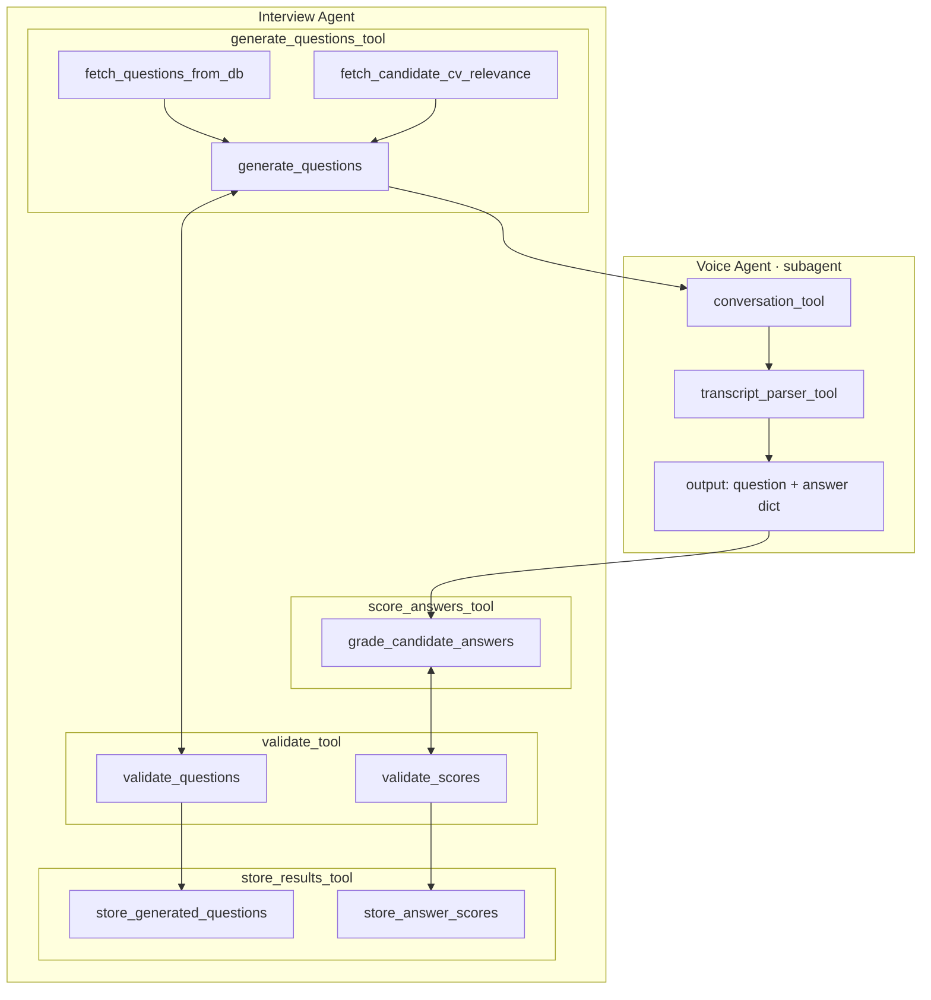

# Russel-AI Agent Architecture

This file documents the agentic architecture for the interview pipeline
(Interview Agent + Voice Agent subagent), and the tool I/O contracts between
them.

- **Flow diagram (below): final.** Treat this as canonical when designing
  `ai/` agents and the `backend/` endpoints/services that orchestrate them.
- **Tool schemas (below): working draft.** Field names/types are a
  first-pass design and don't all line up with
  [.claude/database-schema.md](database-schema.md) yet (e.g. ids, FK names,
  `True`/`None` vs JSON `true`/`null`). These will be corrected as the
  `ai/` and `backend/` implementations are built — don't treat mismatches
  with the DB schema as bugs to silently "fix" without checking in first.

## Flow Diagram

# ============================================================
# AGENT STATE (passed in/out of every node)
# ============================================================

{
  "candidate_id": "uuid",
  "job_posting_id": "uuid",
  "application_id": "uuid",
  "interview_round_type_id": int,
  "job_role_id": int,
  "experience_level_id": int,
  "last_tool_used": "str",
  "status": "success" | "error"
}

# ============================================================
# 1. generate_questions_tool
# ============================================================

# generate_questions_tool INPUT
# (everything else comes from agent state)
{
  "count": int                      # optional, default 10
}

# --- internal functions ---

# fetch_questions_from_db()
# INPUT
{
  "limit": int                      # optional, default 20
}
Simply fetchs the questions at random.
# OUTPUT
{
  "questions": [
    { "question_text": "str" }
  ]
}

# fetch_candidate_cv_relevance()
# INPUT  — pulls candidate_id from state, no explicit input needed
{}
Fetches candidate skills and projects on which he worked on from his cv. Takes the required skill from job post and extracts the unrelated candidate skills and projects, returns the job experience, relevant projects and skills.
# OUTPUT
{
  "job_experience_summary": "str",
  "relevant_skills": [
    {
      "skill_name": "str",
      "proficiency_level": "str",
      "years_of_experience": int
    }
  ],
  "relevant_projects": [
    {
      "project_name": "str",
      "description": "str",
      "skills_used": ["str"]
    }
  ]
}

# generate_questions()
# INPUT
{
  "example_questions": [...],       # from fetch_questions_from_db
  "candidate_relevance": {...},     # from fetch_candidate_cv_relevance
  "count": int
}
The question generator shall generate based on round type, experience level and job role. Use this metric for now:

🚀 Tech Roles (Software Engineers, Data Scientists, Architects)
Experience Level [1]
Coding / Technical Round
System Design Round
Behavioral / Culture Fit
Junior (0-2 Yrs)
70%
10%
20%
Mid-Level (3-6 Yrs)
50%
30%
20%
Senior (7+ Yrs)
20%
50%
30%

💼 Product & Management (Product Managers, Scrum Masters, Engineering Managers)
Experience Level
Product Sense / Strategy
Execution / Analytics
Leadership & Culture
Junior (0-2 Yrs)
30%
50%
20%
Mid-Level (3-6 Yrs)
40%
35%
25%
Senior / Leadership
50%
15%
35%

📈 Business & Operations (Sales, HR, Marketing, Operations)
Experience Level
Case Study / Domain Skills
Past Performance / Metrics
Culture Fit / EQ
Junior (0-2 Yrs)
50%
20%
30%
Mid-Level (3-6 Yrs)
35%
40%
25%
Senior / Executive
20%
40%
40%

Global Interview Weightage: CV vs. Job Skills
Junior (0-2 Yrs)
Questions From CV / Resume: 25%
Live Required Job Skills: 75%
Mid-Level (3-6 Yrs)
Questions From CV / Resume: 50%
Live Required Job Skills: 50%
Senior (7+ Yrs)
Questions From CV / Resume: 70%
Live Required Job Skills: 30%

# OUTPUT
{
  "generated_questions": [
    { "question_text": "str" }
  ]
}

# generate_questions_tool FINAL OUTPUT
{
  "status": "success" | "error",
  "total_questions": int,
  "questions": [
    { "question_text": "str" }
  ]
}

# ============================================================
# 2. score_answers_tool
# ============================================================

# score_answers_tool INPUT
{
  "answers": [
    {
      "question_text": "str",
      "candidate_answer": "str"
    }
  ]
}

# --- no need for an internal function —
# will simply score answers of candidate. Score will be impacted by relevancy, how candidate answered etc. it will also calculate score. 

# score_answers_tool OUTPUT
{
  "status": "success" | "error",
  "overall_score": float,
  "total_graded": int,
  "graded_answers": [
    {
      "question_text": "str",
      "candidate_answer": "str",
      "score": int,
      "notes": "str"
    }
  ]
}

# for now only these 2 tools. rest ill add later.
