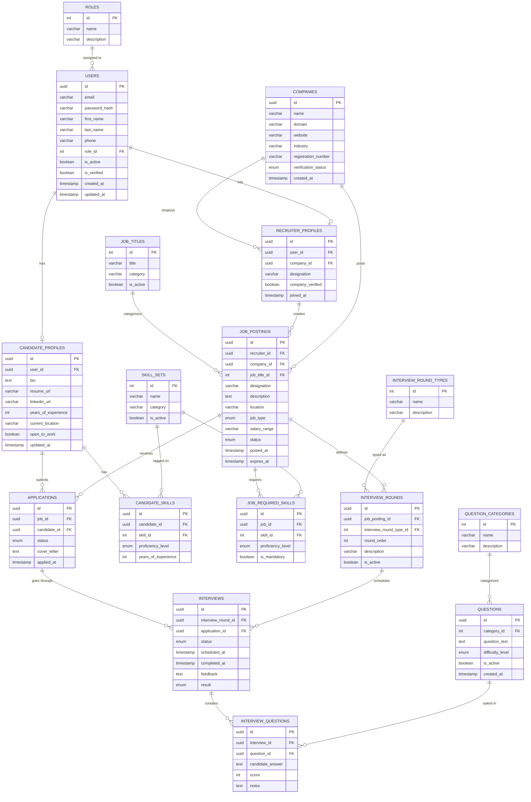

# Russel-AI: Your AI Recruitment & Talent Intelligence Platform
Russel.AI is an AI-powered talent intelligence platform that streamlines the hiring process for recruiters and accelerates career growth for candidates. The platform automates candidate screening, interviews, evaluation, ranking, and reporting, helping recruiters focus only on the most qualified applicants. For candidates, Russel.AI provides AI mock interviews, skill gap analysis, personalized preparation guidance, and career insights to improve job readiness and hiring success.

---
 
## Overview
 
HireIQ serves two sides of the hiring process:
 
- **Recruiters** post jobs, define interview rounds, and receive a shortlisted, ranked set of candidates — with minimal manual effort.
- **Candidates** apply for jobs, go through AI-conducted interviews, and get personalised feedback on skill gaps and how to improve.
---
 
## Core Features
 
### For Recruiters
- Post job listings with required skills, experience level, and interview round definitions
- Company verification flow — recruiters must be linked to a verified company before posting
- Automated candidate screening based on skill match between candidate profile and job requirements
- AI-conducted interview rounds (configurable per job posting)
- Detailed interview reports per candidate with scores, answers, and feedback
- Final shortlist delivered — only top candidates surface to the recruiter
### For Candidates
- Sign up, build a profile with skills, experience, resume, and LinkedIn
- Browse and apply to job postings
- Attend AI-conducted interviews per application
- Receive post-interview feedback and scores
- **Mock interview mode** — practice interviews independent of any job application
- **Gap analysis** — system compares candidate skills against current market demand and highlights areas to work on
- Personalised preparation recommendations
### For Admins
- Verify companies and manage recruiter access
- Manage lookup data: roles, job titles, skill sets, question categories, interview round types
- Platform-wide oversight
---
 
## Database Schema
 
17 tables across the following domains:
 
| Domain | Tables |
|---|---|
| Auth & Roles | `ROLES`, `USERS` |
| Profiles | `RECRUITER_PROFILES`, `CANDIDATE_PROFILES` |
| Company | `COMPANIES` |
| Jobs | `JOB_TITLES`, `JOB_POSTINGS` |
| Applications | `APPLICATIONS` |
| Skills | `SKILL_SETS`, `CANDIDATE_SKILLS`, `JOB_REQUIRED_SKILLS` |
| Interviews | `INTERVIEW_ROUND_TYPES`, `INTERVIEW_ROUNDS`, `INTERVIEWS`, `INTERVIEW_QUESTIONS` |
| Questions | `QUESTION_CATEGORIES`, `QUESTIONS` |
 
### ER Diagram
 

 
---
 
## User Roles
 
| Role | Description |
|---|---|
| `candidate` | Signs up to find jobs, attend interviews, and prepare |
| `recruiter` | Posts jobs, defines interview rounds, reviews shortlisted candidates |
| `admin` | Verifies companies, manages platform data |
 
---
 
## System Flow
 
```
Recruiter posts job → Candidates apply → AI screens by skill match
→ AI conducts interview rounds → Scores & feedback generated
→ Recruiter receives shortlisted candidates with reports
```
 
```
Candidate signs up → Builds profile → Applies to jobs
→ Attends AI interviews → Gets feedback & gap analysis
→ Practices via mock interviews → Improves and re-applies
```
 
---
 
## System Design
 
- Full flow diagram: [draw.io](https://app.diagrams.net/#G1CyvYuqgtQgt8ghGicG6CHgu0zTUcIK5C#%7B%22pageId%22%3A%22FgCxdf08D7E8nqMTdc42%22%7D)
 


